# What is Chemicals?

```mermaid
graph TD
    A[🔴 Single Atom<br/>Like one LEGO block<br/>Example: Oxygen atom] --> B{When atoms stick together...}
    
    B --> C[💧 Water Chemical<br/>H₂O<br/>2 Hydrogen + 1 Oxygen]
    B --> D[🧂 Salt Chemical<br/>NaCl<br/>Sodium + Chlorine]
    B --> E[🍯 Sugar Chemical<br/>C₆H₁₂O₆<br/>Carbon + Hydrogen + Oxygen]
    B --> F[💨 Oxygen Gas<br/>O₂<br/>2 Oxygen atoms together]
    
    G[🏠 Everything around us<br/>is made of chemicals!] --> H[Your toys 🧸]
    G --> I[Your food 🍎]
    G --> J[The air 💨]
    G --> K[Even you! 👶]
    
    C --> G
    D --> G
    E --> G
    F --> G
    
    style A fill:#ffcccc
    style B fill:#ffffcc
    style C fill:#ccffff
    style D fill:#ccffcc
    style E fill:#ffccff
    style F fill:#ccccff
    style G fill:#fff2cc
```

1. **Single atoms** are like individual LEGO blocks
2. **When atoms stick together**, they make chemicals (like connecting LEGO blocks)
3. **Different combinations** make different chemicals:
   - Water = 2 hydrogen atoms + 1 oxygen atom
   - Salt = 1 sodium atom + 1 chlorine atom  
   - Sugar = lots of carbon, hydrogen, and oxygen atoms
4. **Everything around us** is made from these chemical combinations!

So yes, you're absolutely right! Anything made of atoms working together is called a chemical. Even you are made of millions and millions of different chemicals all working together to make... YOU! 

Pretty cool how tiny invisible atoms can build everything we see, right?

## Is it single atom is chemical?

Technically, a single atom by itself is usually called an "element," not a chemical.

- Single atom = `Element` (like a single LEGO block with its own name)
- Two or more atoms together = `Chemical` (like LEGO blocks connected together)

```mermaid
graph TD
    A[🔴 Single Atom] --> B{What do we call it?}
    
    B --> C[📚 In science class:<br>Usually called an ELEMENT<br/>Like: Oxygen, Carbon, Gold]
    
    B --> D[🌍 In everyday life:<br/>People sometimes say chemical<br/>But it's more accurate to say element]
    
    E[👥 Two or more atoms together] --> F[✅ Definitely called a CHEMICAL<br/>or COMPOUND<br/>Like: Water H₂O, Salt NaCl]
    
    G[🤔 The Confusing Part:] --> H[Even single atoms can react<br/>and do chemical things<br/>So some people call them chemicals too!]
    
    I[🎯 Best Answer for You:] --> J[Single atom = ELEMENT<br/>Atoms working together = CHEMICAL]
    
    style A fill:#ffcccc
    style C fill:#ccffcc
    style D fill:#ffffcc
    style F fill:#ccffff
    style I fill:#fff2cc
    style J fill:#e6ffe6
```

